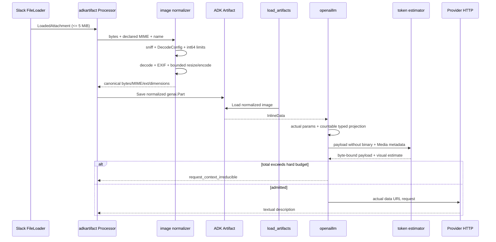

# TRD: admision multimodal de adjuntos de imagen

## Estado

- Estado: Implemented (P0) - code review approved
- Fecha: 2026-08-03
- Feature: `slack-image-attachments`
- Identificador: `request-context-irreducible`
- Documento predecesor: `docs/SLACK-FILES-ADK-ARTIFACTS-TRD.md`
- Alcance: imagenes inbound de Slack procesadas por `attachment_analyzer`; texto y audio conservan su conducta actual.

### Ejecucion P0 (2026-08-04)

Implementacion P0 completa en la worktree
`.worktrees/slack-image-attachments-request-context-irreducible` (rama
`feat/slack-image-attachments-multimodal`):

- Normalizador interno `internal/adapter/adkartifact/image.go` con sniff
  `image.DecodeConfig` antes de decode completo, limites FR-04 con aritmetica
  `int64`, orientacion EXIF antes de resize, sin upscale, edge final 1.568 px,
  canonizacion FR-07, reintentos por edges `1568,1344,1152,1024,768,512` y
  limite 2 MiB. Dependencias pure Go fijadas: `github.com/disintegration/imaging
  v1.6.2` y `golang.org/x/image v0.41.0` (sin CGO, sin encoder WebP).
- Processor de `adkartifact` normaliza antes de `Artifact.Save`; el Artifact
  visual contiene solo el derivado con MIME/extension canonicos; texto y audio
  conservan su ruta. Errores typed en `internal/domain` con codigos
  `attachment_image_invalid`, `attachment_image_format_unsupported`,
  `attachment_image_dimensions_exceeded` y
  `attachment_image_normalized_too_large`.
- `ModelRequestEnvelope.Media` en `internal/port/model_context.go`; conversion
  tipada de una pasada en `openaillm` con data URL real en el request HTTP y
  proyeccion contable con marcador fijo `local-agent://media/omitted`;
  serializer `openai-chat-completions-v1` sin media y
  `openai-chat-completions-multimodal-v2` con media.
- Factory `tokencounter.New(strategy, id)` con `byte_bound` (sin media) y
  `estimator`/`visual-tile-conservative-v1` (FR-14, `Exact=false`);
  combinaciones no implementadas fallan en startup y doctor sin fallback.
  `attachment_analyzer` exige `estimator`/`visual-tile-conservative-v1`
  (FR-18) via `agentdef.ValidateAttachmentModelCapability`.
- Fixture sanitizado `internal/integration/testdata/attachment-screenshot-600k.jpg`
  (1600x1200, 649.884 bytes) y regresion end-to-end
  `internal/integration/attachment_image_test.go`: el request legacy base64+
  byte-bound excede 65.536; la ruta nueva admite la peticion visual bajo el hard
  limit con payload contable sin base64; el caso sobre presupuesto prueba cero
  requests HTTP visuales.

Comandos ejecutados en la worktree (todos verdes salvo indicacion):

```sh
go build -trimpath ./cmd/local-agent
go test ./...
go vet ./...
git diff --check
go mod tidy && go mod verify
```

`go test ./...` deja dos fallos preexistentes ajenos a P0
(`internal/agentdef`: `TestTrackedDefinitionsLoad` y
`TestTrackedWorkflowFixturesLoad`), que tambien fallan en `main`: el commit
`3040fcc` elimino las definiciones trackeadas de `.local-agent/` que esos tests
cargan; su restauracion queda fuera del alcance P0.

## Contexto y problema

El incidente reportado ocurre al adjuntar una imagen de aproximadamente 600 KiB. El `attachment_analyzer` falla antes de HTTP con `request_context_irreducible`: el request serializado se estima en aproximadamente 800.466 tokens y supera un limite duro observado de 65.536. El archivo nunca llega al proveedor.

La causa no es el coste visual real. El pipeline guarda bytes originales, los convierte a una data URL base64 y aplica `byte_bound` al JSON completo. Base64 aumenta el payload y `byte_bound` trata cada byte serializado como un token. Con 65.536 tokens, el espacio practico para binario base64 queda cerca de 48 KiB antes de considerar el resto del request.

La correccion requiere dos controles complementarios:

1. Normalizar la imagen antes de guardarla como Artifact para acotar dimensiones, bytes, formato y riesgo de decodificacion.
2. Contar el request multimodal como payload textual sin binario mas un coste visual basado en dimensiones y capacidad del perfil.

Aplicar solo resize no elimina el conteo artificial de base64. Aplicar solo un estimador permite enviar archivos hostiles o innecesariamente grandes. Ambos controles son P0.

## Estado actual verificado

| Hecho | Evidencia |
| --- | --- |
| `Processor.Process` crea `genai.NewPartFromBytes` con `Attachment.Data` y el MIME declarado antes de clasificar el archivo. | `internal/adapter/adkartifact/processor.go:56-95`. |
| Imagenes aceptadas se deciden solo por MIME declarado (`png`, `jpeg`, `webp`, `gif`). | `internal/adapter/adkartifact/processor.go:90-94,293-299`. |
| El analyzer usa `loadartifactstool.New`, el mismo Artifact service y una sesion in-memory. | `internal/adapter/adkartifact/processor.go:161-229`. |
| La prueba actual de imagen usa bytes literales `png`, no una imagen real decodificable. | `internal/adapter/adkartifact/processor_test.go:142-160`. |
| `openaillm` convierte cada imagen a `data:<mime>;base64,...` y no emite `detail`. | `internal/adapter/openaillm/convert.go:192-200`. |
| El guard serializa los parametros ya convertidos y llama al counter antes del proveedor. | `internal/adapter/openaillm/llm.go:187-231,249-273`. |
| `ModelRequestEnvelope` solo contiene serializer, profile y texto serializado. | `internal/port/model_context.go:10-24`. |
| `byte_bound` devuelve `len(envelope.Serialized)` y `Exact=false`. | `internal/adapter/tokencounter/tokencounter.go:17-31`. |
| El loader acepta `official`, `endpoint`, `estimator` y `byte_bound`; los tres primeros requieren ID. | `internal/agentdef/loader.go:624-636`. |
| La factory runtime solo implementa `byte_bound` y recibe estrategia, no `CounterID`. | `internal/adapter/tokencounter/tokencounter.go:34-42`; `internal/app/composition.go:346-357`. |
| Todo modelo `openai_compatible`, incluido el analyzer, recibe counter y hard budget al construirse. | `internal/app/model_builder.go:119-141`; `internal/app/composition.go:297-308`. |
| El hard budget es `floor(context_window_tokens * max_request_percent / 100)`. | `internal/domain/context_budget.go:50-68`. |
| El default de `max_request_percent` es 60%. | `internal/config/config.go:242-247`. |
| Slack permite configurar hasta 5 MiB por archivo. | `internal/config/validate.go:195-205`. |
| Doctor offline informa la estrategia, pero no comprueba que la factory implemente el ID; doctor live construye el modelo por la ruta real. | `internal/usecase/doctor/service.go:580-610`; `internal/app/live.go:236-269`. |
| El live check visual usa un PNG 1x1 y verifica que se llame `load_artifacts`. | `internal/app/live.go:152-175`. |
| No hay perfiles desplegados `.local-agent/providers/*.yaml` en este checkout; modelo, ventana y perfil del incidente no son verificables desde Git. | Inspeccion del checkout al 2026-08-03. |

### Correccion del TRD predecesor

Este TRD reemplaza, solo para imagenes, estas afirmaciones de `docs/SLACK-FILES-ADK-ARTIFACTS-TRD.md`:

- `:328-340`: no se guardan bytes visuales descargados directamente; se guarda el derivado normalizado.
- `:343-345`: el nombre de Artifact usa extension canonica derivada del formato real, no la extension Slack.
- `:595`: el Artifact de imagen contiene el derivado normalizado; texto y audio conservan los bytes bounded originales.
- `:683-690`: las pruebas deben validar normalizacion real y no solo presencia de `InlineData`.
- `:739-741`: la integracion debe probar coste visual y ausencia de base64 en el payload contable, ademas del request HTTP visual.

El resto del TRD predecesor permanece vigente.

## Objetivos

- Hacer que una imagen realista de aproximadamente 600 KiB llegue al proveedor sin consumir artificialmente cientos de miles de tokens por su base64.
- Rechazar antes del modelo imagenes corruptas, formatos falsos, dimensiones hostiles y requests cuyo coste visual exceda el hard budget.
- Guardar como Artifact visual un derivado canonico, orientado, acotado y sin metadata, no el archivo original.
- Hacer que imagenes con iguales dimensiones y `detail` tengan el mismo coste visual aunque su compresion sea distinta.
- Completar el seam `estimator` con IDs versionados y fallo de startup para IDs desconocidos.
- Conservar el guard actual para texto, tools y requests sin media.
- Mantener el root text-only: solo la descripcion del analyzer entra a la sesion durable.

## No objetivos

- Cambiar descarga, autorizacion, dedupe, orden de adjuntos o limite Slack de 5 MiB.
- Persistir imagenes originales o normalizadas fuera de `artifact.InMemoryService`.
- Enviar imagenes al root agent.
- Cambiar audio transcription, texto, PDFs, video o Files API en P0/P1.
- Implementar tokenizadores `official` o `endpoint` en P0.
- Garantizar conteo exacto para proveedores que no publican su tokenizacion visual.
- Mejorar animaciones GIF mas alla del primer frame antes de P2.

## Requisitos funcionales

| ID | Comportamiento requerido |
| --- | --- |
| FR-01 | Una imagen declarada con MIME visual permitido debe ser identificada por contenido antes de `Artifact.Save`; el formato real determina decoder, MIME y extension canonicos. |
| FR-02 | Formato no soportado, contenido corrupto o falsa declaracion que no decodifica como imagen debe fallar con error seguro y accionable antes de Artifact, analyzer y HTTP. |
| FR-03 | `DecodeConfig` debe preceder a la decodificacion completa. Ancho y alto deben ser positivos; su producto se calcula con `int64` y se valida contra limites de edge y pixeles fuente. |
| FR-04 | P0 fija limites internos de 32.768 px por edge y 40.000.000 pixeles fuente. Superarlos produce `attachment_image_dimensions_exceeded` antes de decode completo. |
| FR-05 | La orientacion EXIF debe aplicarse antes del resize. La recodificacion debe eliminar EXIF y metadata no necesaria. |
| FR-06 | La imagen no se amplia. Si su edge mayor supera 1.568 px se reduce preservando aspect ratio. |
| FR-07 | JPEG se recodifica a calidad 85. PNG conserva salida PNG. WebP y primer frame GIF se convierten a PNG cuando hay alpha y a JPEG en caso contrario. Alpha no se aplana silenciosamente. |
| FR-08 | El derivado no puede superar 2 MiB. Si los bytes exceden el limite, se reintenta con edges maximos `1568, 1344, 1152, 1024, 768, 512`, omitiendo niveles mayores que la imagen; tras el ultimo intento se rechaza. |
| FR-09 | GIF usa solo el primer frame y agrega una advertencia determinista al resultado procesado. Contact sheet queda P2. |
| FR-10 | Solo despues de normalizar se crea el `genai.Part`; el Artifact usa MIME real y extension canonica. Texto y audio siguen su ruta existente. |
| FR-11 | `ModelRequestEnvelope` agrega `Media []ModelRequestMedia`; cada item contiene MIME, ancho, alto y detail efectivo, sin bytes ni data URL. |
| FR-12 | La conversion tipada debe producir parametros HTTP reales y una proyeccion contable equivalente donde cada binario se reemplaza por un marcador fijo. No se permiten regex ni postprocesado de JSON/base64. |
| FR-13 | El conteo multimodal es `byte_bound(payload_contable) + sum(estimator(media))`; el base64 real nunca forma parte del payload contable. |
| FR-14 | P0 implementa `strategy: estimator`, ID `visual-tile-conservative-v1`, `Exact=false`: `low=1024`; `auto`, omitido o `high = 1024 + 1024 * ceil(width/512) * ceil(height/512)` tokens por imagen. |
| FR-15 | `tokencounter.New` o su reemplazo debe recibir estrategia e ID. ID desconocido o estrategia aceptada pero no implementada falla al iniciar y en doctor, sin fallback. |
| FR-16 | Un request con media y counter incapaz de valorarla falla antes de HTTP como `request_token_count_unavailable`; nunca vuelve a contar base64 ni ignora media. |
| FR-17 | El hard budget y `IrreducibleContextError` conservan su semantica. Un total multimodal superior al hard limit produce `request_context_irreducible` antes de HTTP. |
| FR-18 | El perfil usado por `attachment_analyzer` debe configurar `token_counter.strategy: estimator` e ID conocido antes del rollout P0. |
| FR-19 | P1 agrega `image_detail` al perfil `openai_compatible`, con valores `auto`, `low`, `high`; vacio omite el campo y es el default. Solo se emite si esta configurado. |
| FR-20 | P1 agrega `slack.files.image_max_edge_pixels`, default 1.568, rango 512..1.568; valores menores reducen el primer nivel sin ampliar imagenes. |

## Requisitos no funcionales

| ID | Requisito |
| --- | --- |
| NFR-01 | Mantener dependencias hexagonales: metadata de request en `internal/port`, politica pura en adapter/counter, tipos ADK/OpenAI dentro de adapters y composicion en `internal/app`. |
| NFR-02 | La normalizacion debe tener CPU, memoria y reintentos acotados; maximo seis encodes por imagen y una decodificacion completa. |
| NFR-03 | Usar decoders pure Go. No introducir encoder WebP ni CGO. Cualquier dependencia nueva queda fijada a version explicita en `go.mod` despues de revision de licencia y advisories. |
| NFR-04 | Errores y logs no incluyen bytes, base64, EXIF, contenido OCR, URLs privadas ni secretos. |
| NFR-05 | Labels de metricas usan enums bounded; dimensiones, bytes y tokens son valores, no labels. |
| NFR-06 | El request HTTP conserva la data URL real y orden de partes. Solo la representacion contable omite binario. |
| NFR-07 | Requests sin imagen mantienen conteo y admission actuales; tools y texto no pierden proteccion. |
| NFR-08 | Tests usan fixtures locales, servidores HTTP locales y Artifacts in-memory; no requieren Slack o proveedor live. |

## Diseno propuesto

### Flujo



### Normalizador interno

Agregar `internal/adapter/adkartifact/image.go`; no agregar un port. El helper recibe bytes y politica interna/configurada y devuelve una estructura privada con bytes, MIME, extension, width, height, source format, source dimensions y warning opcional.

Orden obligatorio:

1. Registrar decoders JPEG, PNG, GIF y WebP pure Go.
2. Ejecutar `image.DecodeConfig` sobre bytes bounded; el nombre de formato devuelto es autoridad.
3. Validar formato allowlisted, dimensiones positivas, edge <= 32.768 y `int64(width)*int64(height) <= 40.000.000`.
4. Decodificar una vez con orientacion EXIF. Para GIF seleccionar primer frame. Cancelacion se comprueba entre fases y reintentos.
5. Calcular dimensiones objetivo sin upscale y aplicar resize de alta calidad.
6. Elegir salida canonica segun FR-07, encodear y comprobar 2 MiB.
7. Si excede, repetir resize/encode con el siguiente edge. No volver a decodificar el original.
8. Construir nombre seguro con stem saneado y extension `.jpg` o `.png`; guardar solo el derivado.

Dependencias candidatas de implementacion: `github.com/disintegration/imaging` para orientacion/resize y `golang.org/x/image/webp` para decode. El ejecutor debe fijar versiones compatibles con Go 1.25; este checkout no contiene versiones directas verificables y por eso este TRD no inventa numeros de version.

### Proyeccion multimodal tipada

El adapter OpenAI debe construir en una sola conversion:

```go
type ModelRequestMedia struct {
    MIMEType string
    Width    int
    Height   int
    Detail   string
}

type ModelRequestEnvelope struct {
    SerializerID string
    ProfileID    string
    Serialized   string
    Media        []ModelRequestMedia
}
```

`Serialized` contiene el mismo shape tipado usado para el guard actual, pero las URLs visuales son un literal fijo como `local-agent://media/omitted`. La lista `Media` conserva el orden de partes. La conversion valida dimensiones mediante `DecodeConfig` del derivado antes de construir ambos parametros. El request real conserva `data:<canonical-mime>;base64,...`.

Usar `openai-chat-completions-v1` para requests sin media y un serializer versionado, por ejemplo `openai-chat-completions-multimodal-v2`, para la nueva representacion. Counters deben rechazar serializer IDs que no entienden cuando su formula dependa del shape.

### Counter y composicion

`tokencounter` incorpora una factory que recibe `{Strategy, ID}`. P0 soporta:

- `byte_bound`, sin ID: conducta actual cuando `Media` esta vacio; error si hay media.
- `estimator` + `visual-tile-conservative-v1`: byte-bound del payload contable mas FR-14.

`official` y `endpoint` siguen siendo no implementados en P0. Para cerrar la brecha actual, loader/doctor/startup deben distinguir estrategia declarable de implementacion disponible. Un perfil seleccionado con combinacion no disponible falla de forma accionable al cargar la aplicacion. No hay downgrade silencioso.

El estimator conservador no afirma equivalencia con billing del proveedor. Su funcion es admision segura y estable. `Exact=false` debe propagarse a metricas/diagnostico.

### `image_detail`

P1 agrega `ImageDetail` a `agentdef.Profile` y `ResolvedModel`. Validacion:

- solo `openai_compatible`;
- valores vacio, `auto`, `low`, `high`;
- vacio no emite `detail` y se estima conservadoramente como high/auto;
- `low` solo debe elegirse operacionalmente para clasificacion gruesa; no es default del analyzer porque screenshots requieren texto e identificadores legibles.

## Contratos, configuracion y datos

Perfil analyzer esperado para P0:

```yaml
profiles:
  vision:
    model: <provider-model>
    context_window_tokens: <documented-window>
    max_output_tokens: <bounded-output>
    token_counter:
      strategy: estimator
      id: visual-tile-conservative-v1
```

P1 opcional:

```yaml
profiles:
  vision:
    image_detail: auto
```

```yaml
slack:
  files:
    image_max_edge_pixels: 1568
```

No hay migracion SQLite. Los Artifacts son in-memory y efimeros. El cambio de perfil es una migracion operacional: antes de arrancar el binario nuevo, configurar el estimator del perfil visual seleccionado.

## Seguridad

- La fuente sigue bounded por `slack.files.max_bytes_per_file`, pero bytes comprimidos no sustituyen limites de pixeles.
- `DecodeConfig` y aritmetica `int64` bloquean decompression bombs conocidas antes de reservar el raster completo.
- Decoder errors se clasifican y sanitizan; no se devuelve contenido ni metadata.
- Recodificar elimina EXIF, GPS, comentarios y perfiles no necesarios del Artifact enviado.
- El marcador contable nunca contiene bytes, digest o fragmentos base64.
- La data URL real solo vive durante construccion/envio del request; no se registra ni persiste.
- Dependencias de imagen requieren revision, version pinning y fuzzing de decoders P1.

## Errores y resiliencia

| Condicion | Resultado |
| --- | --- |
| MIME visual pero contenido corrupto/no imagen | Error `attachment_image_invalid`; no Artifact/model/HTTP. |
| Formato real soportado distinto al MIME declarado | Aceptar usando MIME/extension reales y registrar mismatch bounded. |
| Formato real no soportado | Error `attachment_image_format_unsupported`. |
| Dimensiones invalidas, overflow o limites fuente excedidos | Error `attachment_image_dimensions_exceeded`; no decode completo. |
| Derivado > 2 MiB tras todos los niveles | Error `attachment_image_normalized_too_large`. |
| GIF animado | Primer frame, warning determinista, procesamiento continua. |
| Counter/ID/serializer desconocido | Startup o count failure accionable; no HTTP. |
| Coste total > hard limit | `request_context_irreducible`; no HTTP. |
| Cancelacion/timeout | Abortar entre fases; no reintento externo ni respuesta parcial. |

El bot conserva semantica all-or-nothing: un adjunto fallido evita la llamada root y produce un unico error Slack seguro asociado al filename.

## Observabilidad

P1 agrega metricas bounded:

| Metrica | Tipo | Labels permitidos |
| --- | --- | --- |
| `attachment_image_normalization_total` | counter | `source_format`, `output_format`, `normalization_outcome` |
| `attachment_image_source_bytes` | observation | ninguna |
| `attachment_image_normalized_bytes` | observation | `output_format` |
| `attachment_image_source_width_pixels` / `height_pixels` | observation | ninguna |
| `attachment_image_normalized_width_pixels` / `height_pixels` | observation | ninguna |
| `model_request_visual_tokens` | observation | `profile_id`, `counter_strategy`, `estimator_id`, `image_detail` |
| `model_request_media_total` | counter | `profile_id`, `normalization_outcome` |

Logs pueden incluir formato, dimensiones, bytes originales/finales, numero de intento, estrategia/ID, estimacion y outcome. No incluyen filename sin sanear, contenido, base64, EXIF ni URL. Dimensiones/bytes no son labels.

## Compatibilidad y migracion

- Texto, tools y requests sin media conservan `byte_bound` y guard actual.
- Audio conserva Artifact original y `/audio/transcriptions` dedicado.
- Imagen Artifact cambia deliberadamente de original a derivado normalizado.
- Root, memoria, Slack rendering y durable sessions siguen recibiendo solo descripcion textual.
- Perfiles visuales con `byte_bound` dejan de ser validos para media y deben migrar al estimator P0.
- No se requiere reset de estado ni cambio de schema.

## Rollout y rollback

1. Entregar P0 tras tests unitarios e integracion hermetica.
2. Actualizar el perfil real de `attachment_analyzer` a `estimator/visual-tile-conservative-v1`.
3. Ejecutar doctor offline; opcionalmente `doctor --live` con el proveedor autorizado.
4. Desplegar y observar rechazos, bytes/dimensiones y estimacion sin contenido.
5. Probar una imagen controlada tipo screenshot de aproximadamente 600 KiB.

Rollback: detener el binario nuevo, restaurar binario anterior y devolver el perfil visual a una estrategia que ese binario soporte. No hay datos persistidos que revertir. No desplegar un perfil `estimator` nuevo con un binario anterior que solo implementa `byte_bound`.

## Estrategia de pruebas

- Normalizador: JPEG EXIF en cada orientacion relevante, PNG alpha, WebP opaque/alpha, GIF multi-frame, imagen pequena, mismatch MIME, corrupcion, edge/pixel overflow y bytes finales.
- Property/fuzz P1: inputs arbitrarios a sniff/DecodeConfig/decode; nunca panic, overflow ni asignacion fuera de limites definidos.
- Counter: mismo ancho/alto y distinta compresion producen igual coste visual; multiples imagenes suman; IDs/serializer desconocidos fallan.
- OpenAI adapter: request HTTP contiene data URL real; envelope contable contiene marcador y no base64; orden text/image se conserva; detail solo opt-in.
- Guard: media sobre presupuesto falla con cero requests HTTP; texto/tools mantienen resultados existentes.
- ADK: `load_artifacts` carga el derivado y la segunda llamada visual devuelve descripcion.
- Integracion: fixture realista que hoy excederia 65.536 bajo byte-bound base64 recorre Artifact -> tool -> request admitido -> descripcion textual root, sin bytes en durable events.

Validacion final requerida al ejecutor:

```sh
go test ./...
go vet ./...
go build -trimpath ./cmd/local-agent
git diff --check
```

## Alternativas evaluadas

1. **Solo aumentar context window o max percent:** rechazado; oculta inflacion y reduce proteccion global.
2. **Solo resize/comprimir:** rechazado; base64 sigue contado como tokens y archivos validos pueden fallar por compresion.
3. **Solo excluir base64:** rechazado; no limita bombas, memoria, red ni coste visual.
4. **Regex para borrar base64 del JSON:** rechazado; fragil ante escapes/shape y puede omitir o alterar datos incorrectos.
5. **Forzar `detail: low`:** rechazado como default; screenshots requieren OCR legible y no corrige normalizacion.
6. **Encoder WebP:** rechazado en P0; agrega complejidad/CGO potencial sin necesidad. WebP se decodifica y canoniza.
7. **Files API en lugar de data URL:** diferido P2; contratos varian por proveedor y no elimina necesidad de estimador/normalizacion.

## Riesgos y mitigaciones

| Riesgo | Mitigacion |
| --- | --- |
| Formula conservadora rechaza demasiado. | ID versionado, metricas y comparacion con usage real P2; nunca relajar silenciosamente. |
| Formula subestima un proveedor. | Edge 1.568, reserva conservadora, hard guard y perfil explicito; proveedor sin semantica aceptable puede fallar doctor. |
| Decoder vulnerable o consumo alto. | Bytes + DecodeConfig + edge/pixel caps, pure Go, version pinning y fuzzing. |
| PNG alpha sigue grande. | Retry de dimensiones hasta 512 y limite final 2 MiB; rechazo claro si no cabe. |
| Recodificacion degrada texto. | No upscale, resize de alta calidad, PNG preservado y JPEG 85; fixtures OCR/screenshot en integracion. |
| Cambio de perfil rompe rollback. | Rollback coordinado de binario y YAML; doctor comprueba disponibilidad antes de trafico. |
| Divergencia actual vs contable. | Construccion tipada en una pasada y tests de contrato; no regex ni marshal independiente desde datos no relacionados. |

## Supuestos

- Los valores 800.466 y 65.536 proceden del incidente reportado; el checkout no contiene la configuracion desplegada para recalcularlos.
- El proveedor visual acepta Chat Completions `image_url` con data URL, como exige el flujo existente.
- Limites P0 de 32.768 edge, 40 MP fuente, 1.568 edge final y 2 MiB final son defaults de seguridad elegidos para este diseno; pueden endurecerse, no relajarse, sin nueva evaluacion.
- `visual-tile-conservative-v1` es politica local de admision, no formula oficial ni estimacion de billing.
- Un mismatch entre dos formatos visuales soportados es aceptable y se canoniza; contenido no visual bajo MIME visual se rechaza.
- La version exacta de dependencias nuevas debe resolverse y fijarse durante P0 porque no esta presente en el repo inspeccionado.

## Decisiones abiertas no bloqueantes

- Nombre final del tipo privado retornado por `image.go`.
- Si el warning GIF se antepone a la descripcion o se representa como metadata interna antes de renderizar; debe ser visible y determinista.
- Formula oficial e IDs adicionales por proveedor en P2.
- Umbrales operacionales para alertas sobre ratio de normalizacion y rechazos.

## Criterios de aceptacion

- [x] Una imagen realista de aproximadamente 600 KiB que hoy supera el hard limit por base64 llega al proveedor y produce una descripcion textual.
- [x] El payload contable no contiene bytes ni base64 de la imagen; el request HTTP conserva la imagen normalizada real.
- [x] Dos imagenes con iguales dimensiones/detail y distinta compresion reciben el mismo coste visual.
- [x] Una imagen cuyo coste visual total supera el presupuesto falla antes de cualquier request HTTP.
- [x] Texto, tools y requests sin media conservan el comportamiento actual del guard.
- [x] Imagenes pequenas no se amplian, pero se recodifican y pierden EXIF/metadata no necesaria.
- [x] Orientacion EXIF queda visualmente correcta y dimensiones finales corresponden a la orientacion aplicada.
- [x] PNG transparente conserva alpha; WebP opaque/alpha produce JPEG/PNG canonico respectivamente.
- [x] GIF procesa primer frame con warning determinista.
- [x] MIME falso, archivo corrupto, dimensiones gigantes y decompression bombs fallan antes del modelo con errores seguros y deterministas.
- [x] Artifact visual contiene solo el derivado normalizado con MIME y extension canonicos.
- [x] `load_artifacts` entrega ese derivado, la peticion visual es admitida y el analyzer devuelve descripcion textual.
- [x] `estimator/visual-tile-conservative-v1` se construye por estrategia+ID; IDs desconocidos fallan al iniciar y en doctor.
- [x] No existe fallback silencioso a conteo de base64 ni a media con coste cero.
- [ ] `image_detail` se omite por default y solo emite `auto|low|high` configurado. (P1 - P1-01, FR-19)
- [ ] Metricas exponen dimensiones/bytes originales y finales, formato, estrategia/ID y estimacion sin contenido sensible. (P1 - P1-03)
- [x] `go test ./...`, `go vet ./...` y `go build -trimpath ./cmd/local-agent` pasan.

## Referencias

- `AGENTS.md`
- `docs/SLACK-FILES-ADK-ARTIFACTS-TRD.md`
- `docs/ADK-CONTEXT-ADMISSION-ACP-RECOVERY-TRD.md`
- `internal/adapter/adkartifact/processor.go`
- `internal/adapter/adkartifact/processor_test.go`
- `internal/adapter/openaillm/convert.go`
- `internal/adapter/openaillm/llm.go`
- `internal/adapter/openaillm/llm_test.go`
- `internal/adapter/tokencounter/tokencounter.go`
- `internal/port/model_context.go`
- `internal/agentdef/types.go`
- `internal/agentdef/loader.go`
- `internal/agentdef/resolver.go`
- `internal/app/model_builder.go`
- `internal/app/composition.go`
- `internal/app/live.go`
- `internal/domain/context_budget.go`
- `internal/domain/context_metrics.go`
- `internal/config/config.go`
- `internal/config/validate.go`
- `internal/usecase/doctor/service.go`

## Estado P0 (2026-08-04)

- 15/17 criterios de aceptacion cumplidos con evidencia de tests; los 2 restantes quedan diferidos a P1 por diseno (P1-01 `image_detail`, P1-03 metricas), sin gap de alcance P0.
- Code review del P0: veredicto approved; CR1-CR6 validados sin hallazgos accionables ni regresiones:
  - CR1: la proyeccion contable v1 usa `byte_bound` conservando el ajuste 2x; regresion en `compiler_test.go:64`.
  - CR2: el audio real se incluye en la proyeccion v1 con guard antes de HTTP.
  - CR3: los counters auxiliares se validan fuera del bloque root OpenAI.
  - CR4: multiplicaciones/sumas checked, dimensiones negativas rechazadas y overflow acumulado probado.
  - CR5: `byte_bound` exige ID vacio en loader, capability y factory.
  - CR6: el test exige exclusivamente `ErrIrreducibleContext` y valida limites.
- Commits del P0 en la rama `feat/slack-image-attachments-multimodal`: `194441b`, `1f244bc`, `a64fe4e`, `2b5dd78`. PR #35 contra `main`: https://github.com/Dauno/local-agent/pull/35
- Comandos verdes confirmados: `go test ./...`, `go vet ./...`, `go build -trimpath ./cmd/local-agent`, `git diff --check`.
